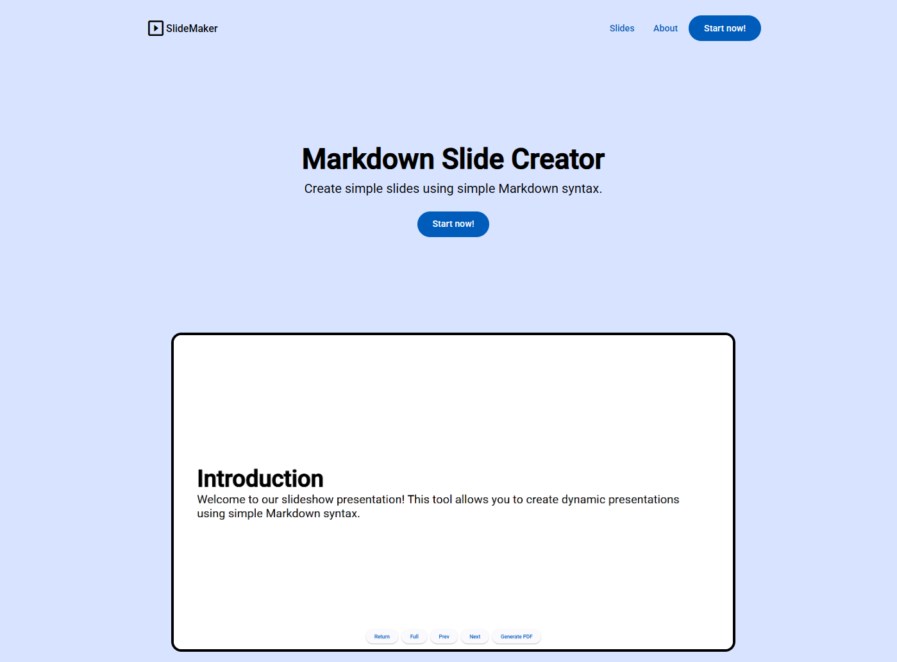

# 📄 Angular Slideshow Maker

Create simple slides using simple Markdown syntax.



<p align="center">
  
  
</p>

## 🏃 Getting Started

First, clone this repository and access the created folder:

```bash
# Cloning repository
git clone https://github.com/iamtheluiz/angular-slideshow-maker.git

cd angular-slideshow-maker/
```

Install all NodeJS dependencies:

```bash
npm install
```

## 👨🏽‍💻 Usage

To run this project in a local environment use:

```bash
npm run start
```

Then open [http://localhost:4200](http://localhost:4200) to view it in the browser.

## ⚙️ Build

To build this project, run:

```bash
npm run build
```

## 💼 Authors

- **Luiz Gustavo** - _Development_ - [iamtheluiz](https://github.com/iamtheluiz)
  - Website: https://iamtheluiz.github.io
  - Github: [@iamtheluiz](https://github.com/iamtheluiz)
  - LinkedIn: [Luiz Gustavo da Silva Vasconcellos](https://www.linkedin.com/in/luiz-gustavo-da-silva-vasconcellos)
